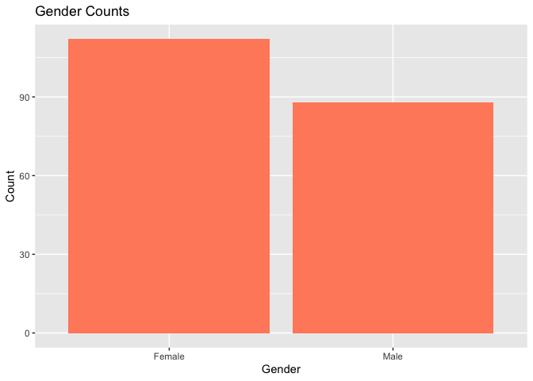
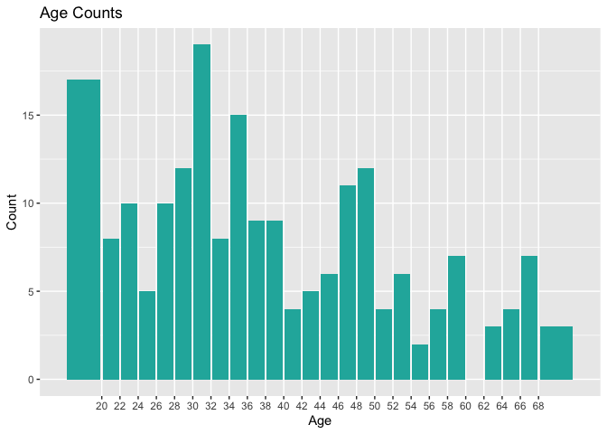
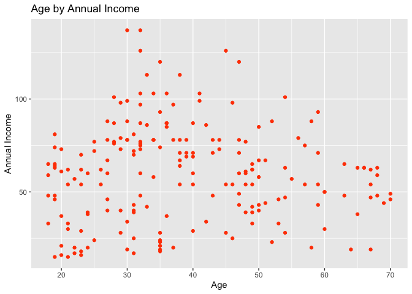
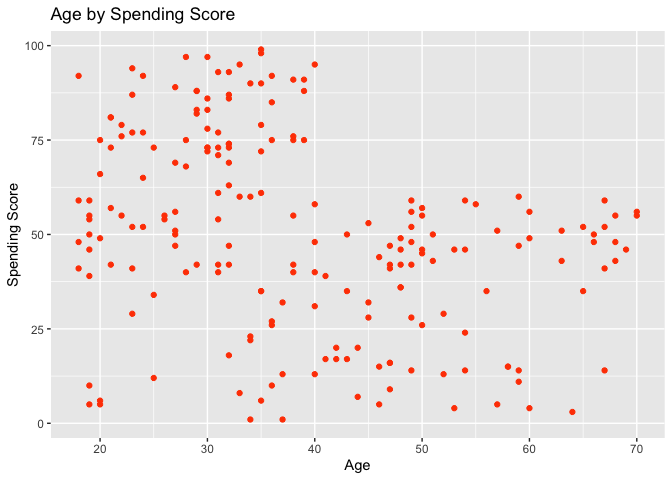
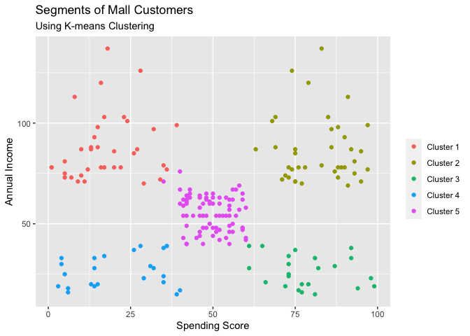
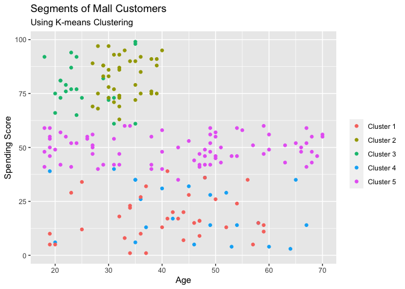
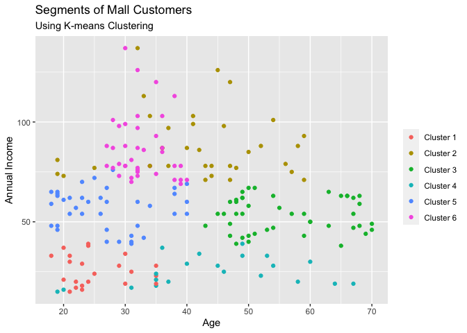

Customer\_Segmentation\_with\_R
================

## Introduction

This project explores using K-Means clustering for market segmentation
using R. For this project, I am using a dataset of mall customers. The
dataset includes the gender, age, annual income, and spending score
(rated from 1-100) of each customer. The end goal of the project is to
separate the customers into targetable segments of the population.

## Load Libraries and Data

``` r
library(tidyverse)
```

    ## ── Attaching packages ─────────────────────────────────────── tidyverse 1.3.0 ──

    ## ✓ ggplot2 3.3.3     ✓ purrr   0.3.4
    ## ✓ tibble  3.0.6     ✓ dplyr   1.0.4
    ## ✓ tidyr   1.1.2     ✓ stringr 1.4.0
    ## ✓ readr   1.3.1     ✓ forcats 0.4.0

    ## ── Conflicts ────────────────────────────────────────── tidyverse_conflicts() ──
    ## x dplyr::filter() masks stats::filter()
    ## x dplyr::lag()    masks stats::lag()

``` r
library(readr)
library(broom)
data = read_csv('Mall_Customers.csv')
```

    ## Parsed with column specification:
    ## cols(
    ##   CustomerID = col_double(),
    ##   Gender = col_character(),
    ##   Age = col_double(),
    ##   `Annual Income (k$)` = col_double(),
    ##   `Spending Score (1-100)` = col_double()
    ## )

## Explore Data

To start, I will look at the head of our data, the summary of the data
to look for missing values, and any duplicated rows. The dataset is
pre-cleaned, so I expect there will not be much to note here.

``` r
head(data)
```

    ## # A tibble: 6 x 5
    ##   CustomerID Gender   Age `Annual Income (k$)` `Spending Score (1-100)`
    ##        <dbl> <chr>  <dbl>                <dbl>                    <dbl>
    ## 1          1 Male      19                   15                       39
    ## 2          2 Male      21                   15                       81
    ## 3          3 Female    20                   16                        6
    ## 4          4 Female    23                   16                       77
    ## 5          5 Female    31                   17                       40
    ## 6          6 Female    22                   17                       76

``` r
summary(data)
```

    ##    CustomerID        Gender               Age        Annual Income (k$)
    ##  Min.   :  1.00   Length:200         Min.   :18.00   Min.   : 15.00    
    ##  1st Qu.: 50.75   Class :character   1st Qu.:28.75   1st Qu.: 41.50    
    ##  Median :100.50   Mode  :character   Median :36.00   Median : 61.50    
    ##  Mean   :100.50                      Mean   :38.85   Mean   : 60.56    
    ##  3rd Qu.:150.25                      3rd Qu.:49.00   3rd Qu.: 78.00    
    ##  Max.   :200.00                      Max.   :70.00   Max.   :137.00    
    ##  Spending Score (1-100)
    ##  Min.   : 1.00         
    ##  1st Qu.:34.75         
    ##  Median :50.00         
    ##  Mean   :50.20         
    ##  3rd Qu.:73.00         
    ##  Max.   :99.00

``` r
data[duplicated(data), ]
```

    ## # A tibble: 0 x 5
    ## # … with 5 variables: CustomerID <dbl>, Gender <chr>, Age <dbl>, `Annual Income
    ## #   (k$)` <dbl>, `Spending Score (1-100)` <dbl>

As expected, the dataset is pretty clean. The dataframe looks good, and
there are no duplicated rows. I’m going to rename two of the variables
to make the dataframe a bit neater.

``` r
names(data)[names(data) == 'Annual Income (k$)'] <- 'Annual_Income'
names(data)[names(data) == 'Spending Score (1-100)'] <- 'Spending_Score'
```

Now I will look at some of the distributions for each of our variables.

Gender:

``` r
ggplot(data, aes(x = Gender)) + 
  geom_bar(fill = 'salmon1') + 
  labs(title = 'Gender Counts', x = 'Gender', y = 'Count')
```

<!-- -->
Age:

``` r
ggplot(data, aes(x = Age)) +
  geom_bar(fill='lightseagreen') +
  scale_x_binned(n.breaks = 30) +
  labs(title = 'Age Counts', x = 'Age', y = 'Count')
```

<!-- -->

``` r
ggplot(data, aes(x = Age)) +
  geom_density(fill='lightseagreen') + 
  labs(title = 'Age Density Plot', x = 'Age', y = 'Density')
```

<!-- -->
Interaction of Age and annual income:

``` r
ggplot(data, aes(x = Age, y = Annual_Income)) +
  geom_point(color = 'orangered') + 
  labs(title = 'Age by Annual Income', x = 'Age', y = 'Annual Income')
```

<!-- -->

Interaction of Age and Spending Score:

``` r
ggplot(data, aes(x = Age, y = Spending_Score)) +
  geom_point(color = 'orangered') +
  labs(title = 'Age by Spending Score', x = 'Age', y ='Spending Score')
```

<!-- -->
Finally, the interaction of Income and Spending Score:

``` r
ggplot(data, aes(x = Annual_Income, y = Spending_Score, color = Gender)) +
  geom_point() +
  labs(title = 'Annual Income by Spending Score',
       subtitle = 'Grouped by Gender',
       x= 'Annual Income', y = 'Spending Score')
```

<!-- -->
To determine the number of clusters for our model, I will use the elbow
method. I will plot the variance within groups between 1 and 20 total
clusters.

``` r
tibble(clusters = 1:20) %>% 
  mutate(mod = map(clusters, ~ kmeans(data[,3:5], centers = .x, nstart = 50))) %>%
  mutate(glanced = map(mod, glance)) %>%
  unnest(glanced) %>%
  ggplot(aes(x=clusters, y = tot.withinss/totss)) +
  geom_line()
```

<!-- -->

The elbow plot has a noticeable kink between 5 and 6. Looking at the
plots from earlier (especially the income vs spending score plot) I’m
estimating 5 to be the best number of clusters to use. I will now use
K-Means Clustering with 5 clusters to categorize the data.

``` r
km_5_clusters <- kmeans(data[,3:5], centers = 5, nstart = 50)
km_5_clusters
```

    ## K-means clustering with 5 clusters of sizes 36, 39, 23, 23, 79
    ## 
    ## Cluster means:
    ##        Age Annual_Income Spending_Score
    ## 1 40.66667      87.75000       17.58333
    ## 2 32.69231      86.53846       82.12821
    ## 3 25.52174      26.30435       78.56522
    ## 4 45.21739      26.30435       20.91304
    ## 5 43.08861      55.29114       49.56962
    ## 
    ## Clustering vector:
    ##   [1] 4 3 4 3 4 3 4 3 4 3 4 3 4 3 4 3 4 3 4 3 4 3 4 3 4 3 4 3 4 3 4 3 4 3 4 3 4
    ##  [38] 3 4 3 4 3 4 3 4 3 5 5 5 5 5 5 5 5 5 5 5 5 5 5 5 5 5 5 5 5 5 5 5 5 5 5 5 5
    ##  [75] 5 5 5 5 5 5 5 5 5 5 5 5 5 5 5 5 5 5 5 5 5 5 5 5 5 5 5 5 5 5 5 5 5 5 5 5 5
    ## [112] 5 5 5 5 5 5 5 5 5 5 5 5 2 1 2 5 2 1 2 1 2 1 2 1 2 1 2 1 2 1 2 5 2 1 2 1 2
    ## [149] 1 2 1 2 1 2 1 2 1 2 1 2 1 2 1 2 1 2 1 2 1 2 1 2 1 2 1 2 1 2 1 2 1 2 1 2 1
    ## [186] 2 1 2 1 2 1 2 1 2 1 2 1 2 1 2
    ## 
    ## Within cluster sum of squares by cluster:
    ## [1] 17669.500 13972.359  4622.261  8948.609 30138.051
    ##  (between_SS / total_SS =  75.6 %)
    ## 
    ## Available components:
    ## 
    ## [1] "cluster"      "centers"      "totss"        "withinss"     "tot.withinss"
    ## [6] "betweenss"    "size"         "iter"         "ifault"

``` r
glance(km_5_clusters)
```

    ## # A tibble: 1 x 4
    ##     totss tot.withinss betweenss  iter
    ##     <dbl>        <dbl>     <dbl> <int>
    ## 1 308813.       75351.   233462.     2

Now I will plot the clusters on three plots showing the intersections of
Annual Income, Spending Score and Age.

``` r
ggplot(data, aes(x = Spending_Score, y = Annual_Income)) + 
  geom_point(stat = 'identity', aes(color = as.factor(km_5_clusters$cluster))) +
  scale_color_discrete(name=' ',
                       breaks=c('1', '2', '3', '4', '5'),
                       labels=c('Cluster 1', 'Cluster 2', 'Cluster 3', 
                                'Cluster 4', 'Cluster 5')) +
  labs(title = 'Segments of Mall Customers', 
       subtitle = 'Using K-means Clustering',
       x = 'Spending Score', y = 'Annual Income')
```

<!-- -->

``` r
ggplot(data, aes(x = Age, y = Annual_Income)) + 
  geom_point(stat = 'identity', aes(color = as.factor(km_5_clusters$cluster))) +
  scale_color_discrete(name=' ',
                       breaks=c('1', '2', '3', '4', '5'),
                       labels=c('Cluster 1', 'Cluster 2', 'Cluster 3', 
                       'Cluster 4', 'Cluster 5')) +
  labs(title = 'Segments of Mall Customers', 
       subtitle = 'Using K-means Clustering',
       y = 'Annual Income')
```

<!-- -->

``` r
ggplot(data, aes(x = Age, y = Spending_Score)) + 
  geom_point(stat = 'identity', aes(color = as.factor(km_5_clusters$cluster))) +
  scale_color_discrete(name=' ',
                       breaks=c('1', '2', '3', '4', '5'),
                       labels=c('Cluster 1', 'Cluster 2', 'Cluster 3', 
                                'Cluster 4', 'Cluster 5')) +
  labs(title = 'Segments of Mall Customers', 
       subtitle = 'Using K-means Clustering',
       y = 'Spending Score')
```

<!-- -->

The clusters are well-formed and mostly distinct, especially on the
income vs spending score plot. We seem to have five defined groups: one
with high spending and high income, one with high spending and low
income, one with low income and high spending, one with low income and
low spending, and one with middle scores for the two variables. The only
concern with this model is how much larger cluster 2 is than the other
clusters (79 of 200 data points).

To compare, I will now run K-Means clustering looking for 6 clusters.

``` r
km_6_clusters <- kmeans(data[,3:5], centers = 6, nstart = 50)
km_6_clusters
```

    ## K-means clustering with 6 clusters of sizes 22, 35, 45, 21, 38, 39
    ## 
    ## Cluster means:
    ##        Age Annual_Income Spending_Score
    ## 1 25.27273      25.72727       79.36364
    ## 2 41.68571      88.22857       17.28571
    ## 3 56.15556      53.37778       49.08889
    ## 4 44.14286      25.14286       19.52381
    ## 5 27.00000      56.65789       49.13158
    ## 6 32.69231      86.53846       82.12821
    ## 
    ## Clustering vector:
    ##   [1] 4 1 4 1 4 1 4 1 4 1 4 1 4 1 4 1 4 1 4 1 4 1 4 1 4 1 4 1 4 1 4 1 4 1 4 1 4
    ##  [38] 1 4 1 3 1 3 5 4 1 3 5 5 5 3 5 5 3 3 3 3 3 5 3 3 5 3 3 3 5 3 3 5 5 3 3 3 3
    ##  [75] 3 5 3 5 5 3 3 5 3 3 5 3 3 5 5 3 3 5 3 5 5 5 3 5 3 5 5 3 3 5 3 5 3 3 3 3 3
    ## [112] 5 5 5 5 5 3 3 3 3 5 5 5 6 5 6 2 6 2 6 2 6 5 6 2 6 2 6 2 6 2 6 5 6 2 6 2 6
    ## [149] 2 6 2 6 2 6 2 6 2 6 2 6 2 6 2 6 2 6 2 6 2 6 2 6 2 6 2 6 2 6 2 6 2 6 2 6 2
    ## [186] 6 2 6 2 6 2 6 2 6 2 6 2 6 2 6
    ## 
    ## Within cluster sum of squares by cluster:
    ## [1]  4099.818 16690.857  8062.133  7732.381  7742.895 13972.359
    ##  (between_SS / total_SS =  81.1 %)
    ## 
    ## Available components:
    ## 
    ## [1] "cluster"      "centers"      "totss"        "withinss"     "tot.withinss"
    ## [6] "betweenss"    "size"         "iter"         "ifault"

``` r
glance(km_6_clusters)
```

    ## # A tibble: 1 x 4
    ##     totss tot.withinss betweenss  iter
    ##     <dbl>        <dbl>     <dbl> <int>
    ## 1 308813.       58300.   250512.     3

The clusters are a muh more even size now, but let’s see how well
defined they are.

``` r
ggplot(data, aes(x = Spending_Score, y = Annual_Income)) + 
  geom_point(stat = 'identity', aes(color = as.factor(km_6_clusters$cluster))) +
  scale_color_discrete(name=' ',
                       breaks=c('1', '2', '3', '4', '5','6'),
                       labels=c('Cluster 1', 'Cluster 2', 'Cluster 3',
                                'Cluster 4', 'Cluster 5', 'Cluster 6')) +
  labs(title = 'Segments of Mall Customers', 
       subtitle = 'Using K-means Clustering',
       x = 'Spending Score', y = 'Annual Income')
```

<!-- -->

``` r
ggplot(data, aes(x = Age, y = Annual_Income)) + 
  geom_point(stat = 'identity', aes(color = as.factor(km_6_clusters$cluster))) +
  scale_color_discrete(name=' ',
                       breaks=c('1', '2', '3', '4', '5','6'),
                       labels=c('Cluster 1', 'Cluster 2', 'Cluster 3', 
                                'Cluster 4', 'Cluster 5', 'Cluster 6')) +
  labs(title = 'Segments of Mall Customers', 
       subtitle = 'Using K-means Clustering',
       y = 'Annual Income')
```

<!-- -->

``` r
ggplot(data, aes(x = Age, y = Spending_Score)) + 
  geom_point(stat = 'identity', aes(color = as.factor(km_6_clusters$cluster))) +
  scale_color_discrete(name=' ',
                       breaks=c('1', '2', '3', '4', '5','6'),
                       labels=c('Cluster 1', 'Cluster 2', 'Cluster 3', 
                                'Cluster 4', 'Cluster 5', 'Cluster 6')) +
  labs(title = 'Segments of Mall Customers', 
       subtitle = 'Using K-means Clustering',
       y = 'Spending Score')
```

<!-- -->

There is a considerable amount of overlap now between clusters 1 and 6
on the income vs spending graph, however we are able to draw more
meaningful conclusions regarding age. The model using 5 clusters had a
much wider set of rages present in most clusters than the model using 6
clusters. Using 6 clusters will allow us to better target the shoppers.
