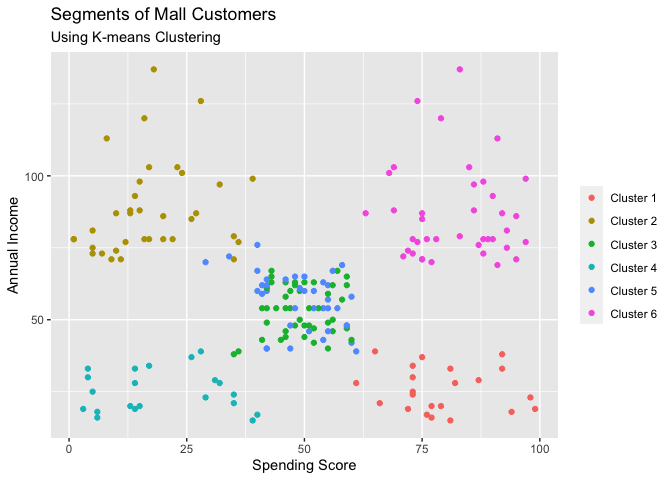

## Introduction

For this mini-project, I am using K-Means clustering to segment mall customers into discernable groups for marketing. The dataset that I will be using comes from [kaggle.com](https://www.kaggle.com/vjchoudhary7/customer-segmentation-tutorial-in-python). I will be running the K-Means algorithm in two languages, R and python, for this project to highlight some similarities and differences between the two. For a more thorough look at the comparison between them, you can read my blog post found [here](https://chrisgrannan.medium.com/k-means-clustering-in-r-and-python-40b99b7308ef). The general overview of both notebooks is the same: load in relevant libraries and data, explore the distributions contained in the dataset, use elbow plotting to find an ideal number of clusters, model the segmentation, and analyze the results.

## EDA

Before modeling I waned to visualize how the dataset was distributed. Below is a barchart showing the male/female split in the data.

There are more females than males in the sample, though not highly unbalanced. Next up is a histogram of the ages present in the sample.

Here we can see that we do not have a normal distribution of ages. The most common age groups are 30 to 32, younger than 20, and 34 to 36. The counts jump around a bit as age increases, but there is a general trend downward. Next up I looked at some interactions between our continuous variables (age, income, and spending score).

Looking at the age vs income level and age vs spending score charts, we do not see any naturally occuring clusters, but when we look at the plot of income level vs spending score we can see that there appear to be five naturally occuring clusters. We have a cluster with high spending and high income, high spending and low income, low spending and high income, low spending and low income, and middle spending and middle income. With that information in mind, I was ready to start modeling.

## Modeling

To determine an ideal number of clusters for the model, I used the elbow method. I plotted out the distortions of a model using every number of clusters from 1 to 20 on a linegraph, and then checked for the largest change in slop of said graph. Here is the output of my elbow plot.

From this plot, I was looking for a model with 5 or 6 clusters as that is where the slope of the linegraph changes most substantially.  From here I ran a K-Means model using 5 clusters. Below are the resulting clusters on plots of our continuous variables.

From these plots, we can see the exact clusters we were able to make out before when looking at the interaction between spending score and income levels. When we look at the two plots involving ages, we can see some defined clusters, but there is a good deal of overlap and a large spread of ages in some clusters. Additionally, one cluster (middle income and middle spending) is much denser than the others. I decided to build a model with 6 clusters and compare it to the 5 cluster model. Here are the resulting plots for the 6 cluster model.

Here we see that the middle income and middle spending cluster has been split into two. This amount of overlap is less than ideal, but we can also see that there is better segmentation when accounting for age. Additionally, the clusters now have more consistent numbers of datapoints in each cluster. The model with 6 clusters is an overall better model for segmenting the customer base.

## Summary

For this project I took a dataset of mall shoppers and segmented it into 6 targetable clusters based on age, income level and spending score. I used fairly basic K-Means Clustering using the elbow method to achieve this segmentation. The modeling is run in both python and R to highlight similarities and differences between the two languages while achieving the same goal.

## Files

Here is a basic outline of the file structure in this repository.

Customer_Segmentation_Using_R_files contains graphs and images from the R notebook.

Data is a folder containing the zipped dataset.

Customer_Segmentation_Using_Python.ipynb is a notebook containing the modeling and analysis in python.

Customer_Segmentation_Using_R.Rmd is a R markdown file containing the modeling and analysis in R. It is a less neat version of Customer_Segmentation_Using_R.md

Customer_Segmentation_Using_R.md is a formated markdown file of the Customer_Segmentation_Using_R.Rmd file. Look here for the modeling and analysis in R.